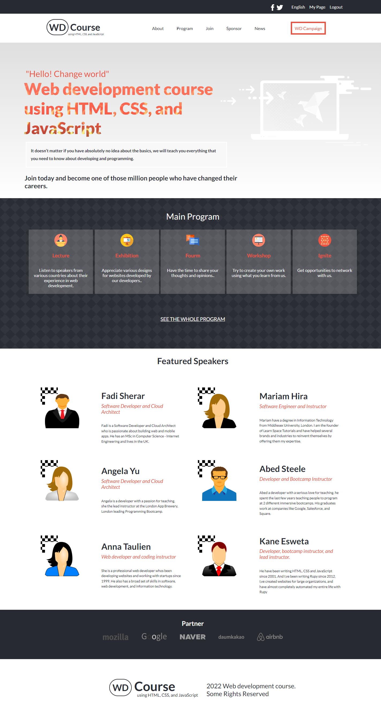
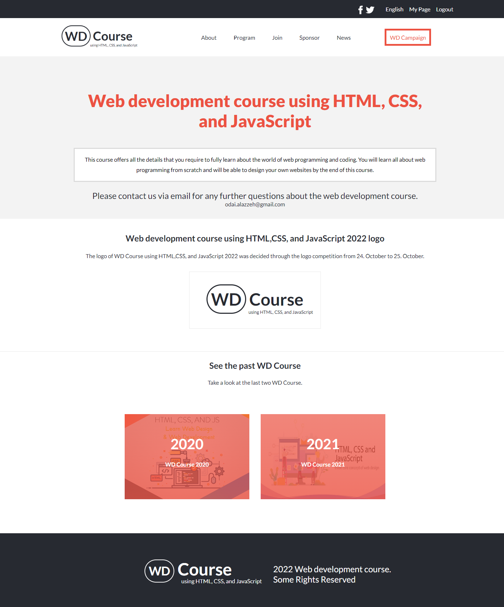

[](https://img.shields.io/badge/Microverse-blueviolet)

# Project Name

 ### Web Development Course
 
This course offers all the details that you require to fully learn about the world of web programming and coding.
You will learn all about web programming from scratch and will be able to design your own websites by the end of this course.


## Built With

- HTML & CSS
- JavaScript

## Screenshot




## Go Live 
https://odaialazzeh.github.io/capstone1-project/


## Getting Started

To get a local copy up and running follow these simple example steps.


### Prerequisites
- Download Visual Studio Code.
- Download Git.

### Install

1. Clone the repo
```sh
   git clone https://github.com/odaialazzeh/protrfolio.git
```
2. Install NPM packages
```sh
   npm install
```

### Run tests
 ```sh
    - Open it by live server in the VScode.
    - Check for the linters
 ```


## Authors

👤 **Odai**

- GitHub: [odaialazzeh](https://github.com/odaialazzeh)


## 🤝 Contributing

Contributions, issues, and feature requests are welcome!

Feel free to contact me @ odai.alazzeh@gmail.com

## Show your support

Give a ⭐️ if you like this project!

## Acknowledgments

A list of resources that i find helpful and would like to give credit to :

- [Microverse ](https://www.microverse.org)
- [GitHub ](https://www.github.com)
- [Youtube ](https://www.youtube.com)
- [W3schools ](https://www.w3schools.com)
- [Stackoverflow ](https://stackoverflow.com)

## 📝 License

This project is [MIT](https://github.com/odaialazzeh/capstone1-project/blob/feature/License) licensed.

